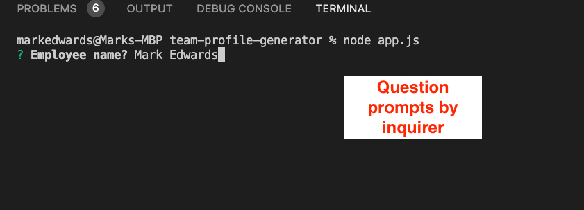

# Team Profile Generator
## Discription
This app allows the user to use node.js and inquirer prompts to generate a html file displaying team members.

- I was motivated to make this app to apply node.js, javascript, and inquirer skill gained in class.
- I built this project to exercise and develop my node.js, javascript, and inquirer knowledge.
- I got to solve how to create a HTML document from inquirer prompts. This gave me an understanding of the basics on how to create a web page for non-coding users to update their company websites. 
- I learnt more about using classes and constructors, what you can use inquirer prompt for, and a buisiness solution.

## Instalation
Programs you will require are: vs code, and a web browser. You will also need to install node.js

## Usage
In VS code you will need to run the following commands: 
- Select 'intergrated terminal' and type in 'npm i' to install package.json

- To run the application, type into intergrated terminal 'node app.js'

- The app will then ask questions.

- The app will then ask if you want to add a new staff member. This will ask the questions again if you confirm 'y', and end the app and generate the html file 'staff.html' if you confirm 'n'.

- To view staff.html right click on the file and select 'View in live server' - note you must have a live server extension in VS code.

- A new browser window will open and you can view the 'staff.html' file.

## Licences
Inquirer and Jest
